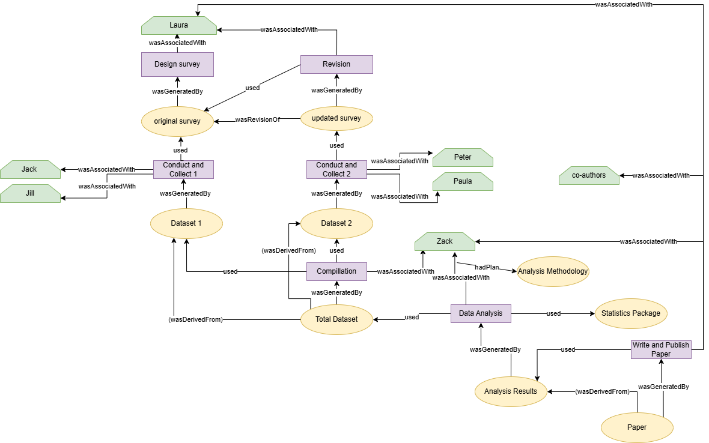

# Seminar Assignment: The Scientific Paper of the Future (UPM)

[](https://doi.org/10.5281/zenodo.18889608)

## Description
This repository named `seminar-data-science` is the practical assignment for the "Scientific Paper of the Future" seminar. It contains a simple Python script as an example of software and a schema of the provenance of the use-case described in exercise 2. The objective is to follow best practices in open science, software metadata, and research provenance.

## Overview
The repository is organized into two main parts:
1. **Exercise 1:** A Python-based tool for statistical analysis, including metadata, persistent identification and license.
2. **Exercise 2:** A provenance record of a research lifecycle using the W3C PROV standard.

## 1. Software and Metadata (Exercise 1)
This section aims to make research software Findable, Accessible, Interoperable, and Reusable (FAIR).

### Included Files:
* **`t_test_example.py`**: A Python script that generates synthetic data for two groups, calculates the t-statistic and p-value, and determines if the null hypothesis is rejected based on a 0.05 significance level.
* **`codemeta.json`**: A metadata file following the CodeMeta standard to describe software authorship, dependencies, and features in an interoperable way.
* **`LICENSE`**: An Apache 2.0 license file defining the legal permissions for the use, modification, and distribution of the code.
* **`requirements.txt`**: A standard file containing the list of Python libraries (`numpy`, `scipy`) required to run the project.

### Installation & usage 
Ensure you have Python 3 installed. You can install all necessary dependencies using the `requirements.txt` file:
```bash
pip install -r requirements.txt
```
Once the dependencies are installed, run the script:
```bash
python t_test_example.py
```
### How to Cite
If you use this work, please cite it as follows. You can also find a **CITATION.cff** file in this repository for automatic citation styling.

Lera, Sara. (2026). **Data Science Seminar Assignment**. (Version 1.0.0). Universidad Politécnica de Madrid. GitHub.https://doi.org/10.5281/zenodo.18889608. 

### License

This project is licensed under the **Apache License 2.0**. This is a permissive license that allows for the use, modification, and distribution of the software, provided that the original copyright and license notice are included. 

For more details, please refer to the [LICENSE](LICENSE) file included in this repository.

## 1. Provenance Diagram (Exercise 2)
This exercise implements the **W3C PROV** standard to document the lifecycle of a research study on student financial support. The goal is to provide full transparency on how the data was created, modified, and analyzed.

### Provenance Diagram
The following diagram illustrates the workflow and traceability of the project described in the slides:


### Breakdown of PROV Elements
Following the exercise requirements, the diagram respects the following 6 key components of the PROV standard:

1. **Entities (Yellow Ovals):** Digital or physical artifacts.
   * *Examples:* `Original Survey`, `Updated Survey`, `Dataset`, and the final `Paper`.
2. **Activities (Purple Rectangles):** Processes that occur over a period of time.
   * *Examples:* `Design`, `Compillation`, `Revision`, `Data Analysis`.
3. **Agents (Green Hexagons):** Those responsible for an activity taking place.
   * *Examples:* `Laura` (Design), `Jack & Jill` (Collection 1), `Zack` (Analysis).
4. **Generation & Usage (wasGeneratedBy / used):**
   * The `Dataset 1` **wasGeneratedBy** the `Conduct and Collect 1` activity.
   * The `Data Analysis` activity **used** the `Total Dataset` entity and a `Statistics Package`. 
5. **Derivation & Revision (wasDerivedFrom / wasRevisionOf):**
   * `Updated Survey` **wasRevisionOf** `Original Survey`, showing the evolution of the research instrument.
   * `Paper` **wasDerivedFrom** `Analysis Results`.
6. **Plans**
   * `Zack` developed the activity `Data Analysis` following a plan (**hadPLan**) `Analysis Methodology`. 
